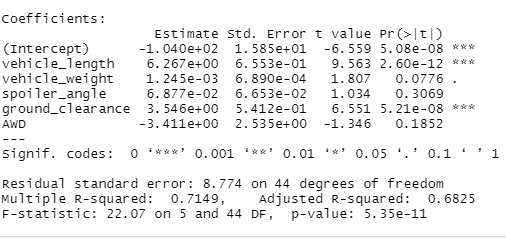
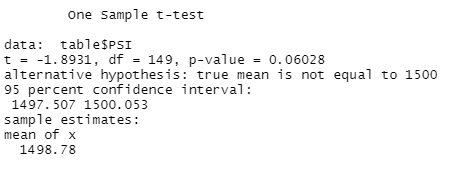
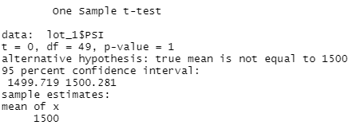
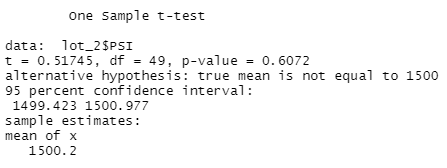
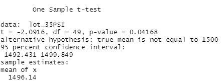

# MechaCar_Statistical_Analysis

## Linear Regression to Predict MPG
I used the MechaCar_mpg database to build a linear regression who can help me predict the MPG of a car based on some of its characteristics. 
I will address the following questions in my analysis : 

Which variables/coefficients provided a non-random amount of variance to the mpg values in the dataset?

Is the slope of the linear model considered to be zero? Why or why not?

Does this linear model predict mpg of MechaCar prototypes effectively? Why or why not?

The answers to these questions are : 

1- There were two variables who provided a non-random amount of variance to the mpg values in the dataset. These variables are the ground clearance and the vehicle lenght. 
They both have p-values under 5 percent which means that they are significatively different from 0. 

2- No, it can not be 0. Two variables are different from 0 at level of confidence of 95%. That means that those variables have an impact on the mpg of the MechaCars. 

3- This model can predict the mpg of MechaCar prototypes effectively based on the R-squared of 0.7149. When the R-squared is close to 1, the model can predict effectively the value of the dependent variable. 

## Summary Statistics on Suspension Coils

In this section, we answer this question : 

The design specifications for the MechaCar suspension coils dictate that the variance of the suspension coils must not exceed 100 pounds per square inch. Does the current manufacturing data meet this design specification for all manufacturing lots in total and each lot individually? Why or why not?

As we can see on the pictures below. For the whole dataset, the variance is below 100 PSI (62.29). However, when we look at each manufacturing lot we can see that Lot 3 does not respect this policy. The variance is 170.29 PSI which is way larger than 100. 

## T-Tests on Suspension Coils

The first t-test that we performed is to see if the population mean is statistically equal to the sample mean. 
As you can see below, we can not reject the null hypothesis that the sample mean is different from 1,500 PSI (at a confidence level of 95%). 

The second t-test is to see if the sample from Lot 1 is different from the population mean. As you can see, we accept the null hypothesis. The means are statistically the same at 95% confidence level. 

The third t-test is to see if the sample from Lot 2 is different from the population mean. With a p-value of 0.61 we can not reject the null hypothesis. There is no statistical difference between Lot2 and the population mean. 

The fourth and final test that we performed is to see if the sample from Lot 3 is different from the population mean. The p-value is equal to 0.042 which is smaller from 0.05. That means that we have to reject the null-hypothesis. Based on that dataset we can say that the mean from lot 3 is different from 1500 PSI. 

